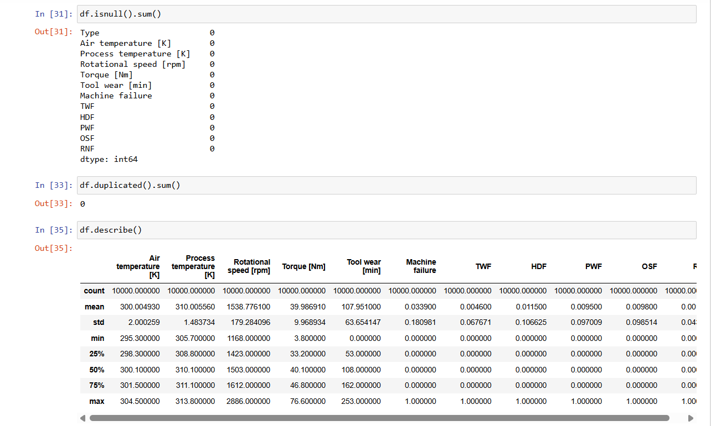
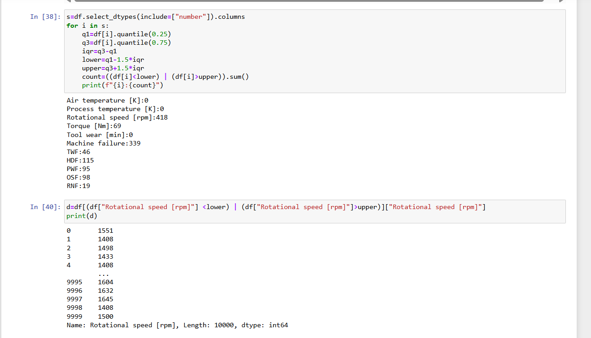
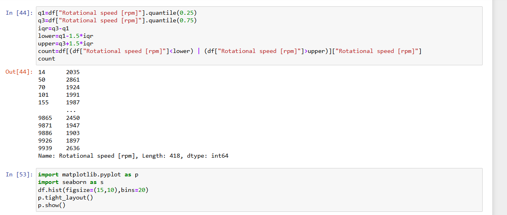
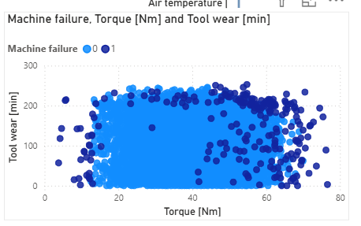
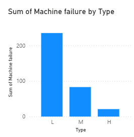
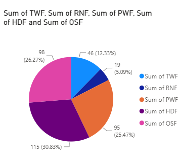

 # ⚙️ Machine Failure Data Analysis & Predictive Maintenance

## 📌 Overview

This project analyzes machine failure data to identify patterns, understand failure factors, and generate insights that can support predictive maintenance decisions.

The goal is to transform raw industrial data into meaningful information using data analysis techniques and visualization tools.

---

## 🎯 Business Problem

Unexpected machine failures can cause production delays and increased maintenance costs.

This project aims to analyze machine conditions and failure indicators to answer questions such as:

- Which machine types have higher failure rates?
- What factors are most related to machine failures?
- How can maintenance decisions be improved using data?

---

## 🛠️ Tools & Technologies

- Python
- Pandas
- NumPy
- Excel
- Power BI
- Jupyter Notebook

---

## 📂 Project Workflow

### 1. Data Preparation
- Loading and understanding the dataset.
- Checking data quality.
- Cleaning and preparing data for analysis.

### 2. Exploratory Data Analysis (EDA)
- Analyzing machine types.
- Studying failure distributions.
- Exploring relationships between machine conditions and failures.

### 3. Data Visualization
- Creating charts to identify important patterns.
- Building interactive dashboards using Power BI.

---

## 📊 Key Analysis

The analysis covers:

- Machine type distribution.
- Failure occurrence analysis.
- Failure factors analysis.
- Comparison between normal and failed machines.

---

## 💡 Key Insights

- Identified important indicators associated with machine failures.
- Analyzed failure patterns across different machine categories.
- Generated visual insights to support maintenance planning.

---

## Project Screenshots

### Python Data Analysis & Machine Learning

### Power BI Dashboard

---

## 📁 Project Structure

machine-failure-analysis/

├── data/
├── notebooks/
├── dashboard/
├── images/
├── reports/
├── README.md
├── requirements.txt
└── .gitignore

## 🚀 Future Improvements

- Build machine learning models for failure prediction.
- Automate data updates.
- Add advanced predictive maintenance features.

---

## 👤 Author

**Esmail Emrany**  
AI Student | Aspiring Data Analyst
